# Azure Sentinel SOC Home Lab - Dokumentacja Projektu

Ten projekt dokumentuje budowę domowego laboratorium SOC (Security Operations Center) opartego na chmurze Microsoft Azure (Sentinel). Celem było zasymulowanie cyberataków, ich detekcja za pomocą reguł analitycznych (KQL) oraz automatyzacja reakcji (SOAR).

## 1. Architektura i Konfiguracja Środowiska
W tej sekcji przedstawiono topologię sieci oraz proces podłączania maszyn (zarówno Azure, jak i on-premise) do usługi Log Analytics Workspace.

* **Topologia sieci:**
    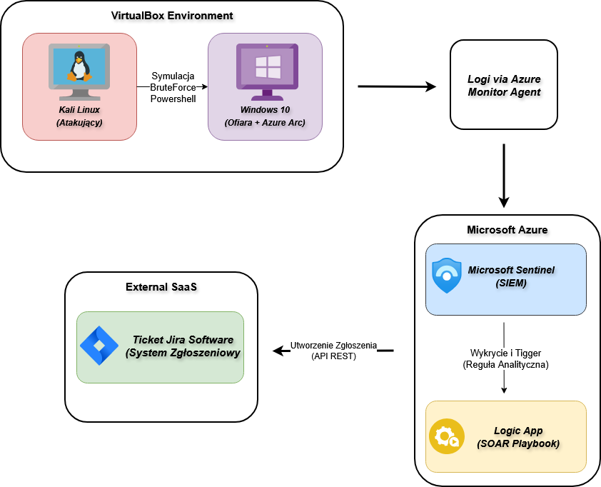
    *Opisuje przepływ logów z maszyn wirtualnych do honeypota i Azure Sentinel.*

* **Konfiguracja Agenta i Azure Arc:**
    * Podłączenie maszyn spoza Azure: 
    * Proces instalacji agenta: 
    * Widok w Azure Arc: 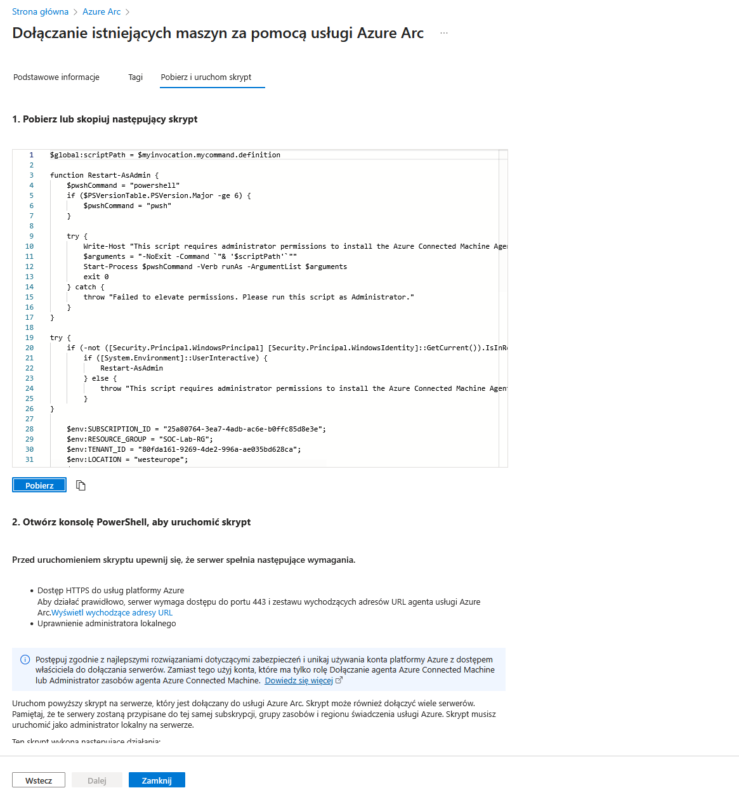
    * Logowanie do panelu Arc: 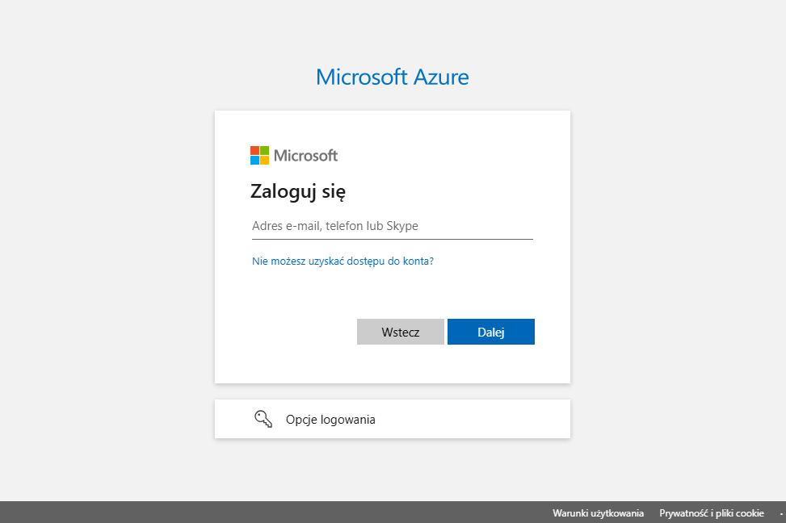

---

## 2. Symulacja Ataków (Red Teaming)
W tej fazie przeprowadzono kontrolowane ataki, aby wygenerować logi zdarzeń (Security Events). Skupiono się na technikach Discovery, Persistence oraz Defense Evasion.

> **Zastosowane Techniki (zgodnie z MITRE ATT&CK):**
> 1.  **Discovery:** Skanowanie i rekonesans (`whoami`, `ipconfig`, `net user`).
> 2.  **Persistence:** Dodawanie użytkownika do grupy Administratorów.
> 3.  **Impact/Evasion:** Zatrzymywanie usług i czyszczenie logów.

* **Wykonywanie skryptów Powershell:**
    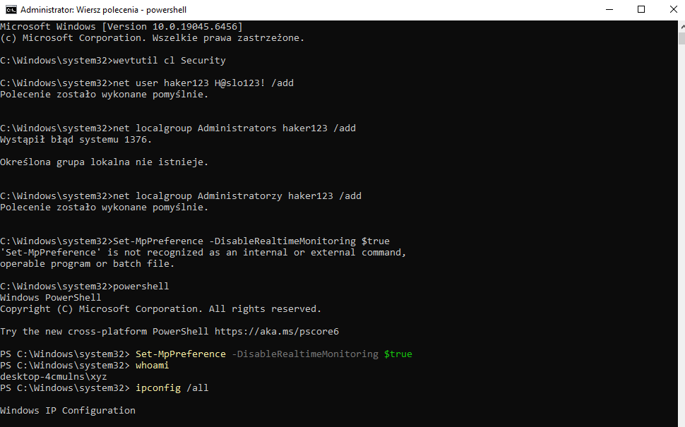
* **Komendy rozpoznawcze (Discovery):**
    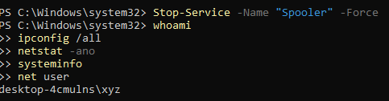
    *Widoczne użycie komend generujących szum w logach, wykrywanych przez korelacje procesów cmd.exe/powershell.exe.*

---

## 3. Detekcja i Analiza Zagrożeń (Blue Teaming)
Wykorzystanie języka KQL (Kusto Query Language) do tworzenia reguł analitycznych w Microsoft Sentinel.

* **Reguły Analityczne (Analytics Rules):**
    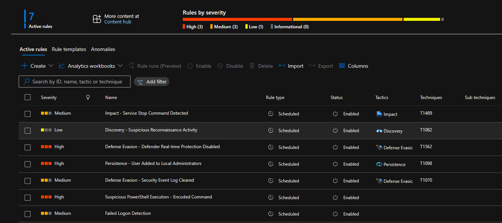
* **Szczegóły reguły (DCR):**
    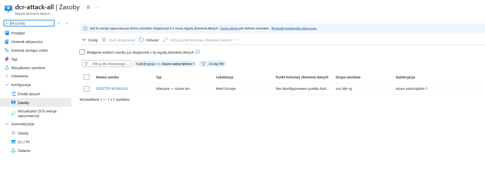
* **Analiza logów Brute Force / Logowania:**
    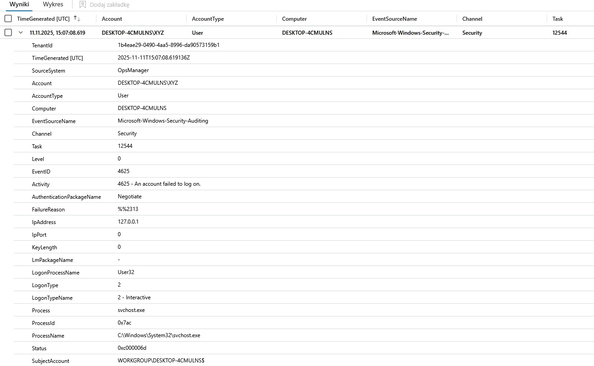
    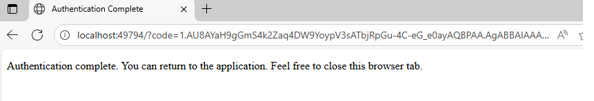
    *Analiza Event ID 4624/4625 oraz prób przełamania haseł.*
* **Threat Hunting:**
     

---

## 4. Zarządzanie Incydentami i Reakcja (Incident Response)
Proces triażu incydentów wygenerowanych przez alerty oraz podgląd szczegółów zdarzenia.

* **Główny panel incydentów:**
    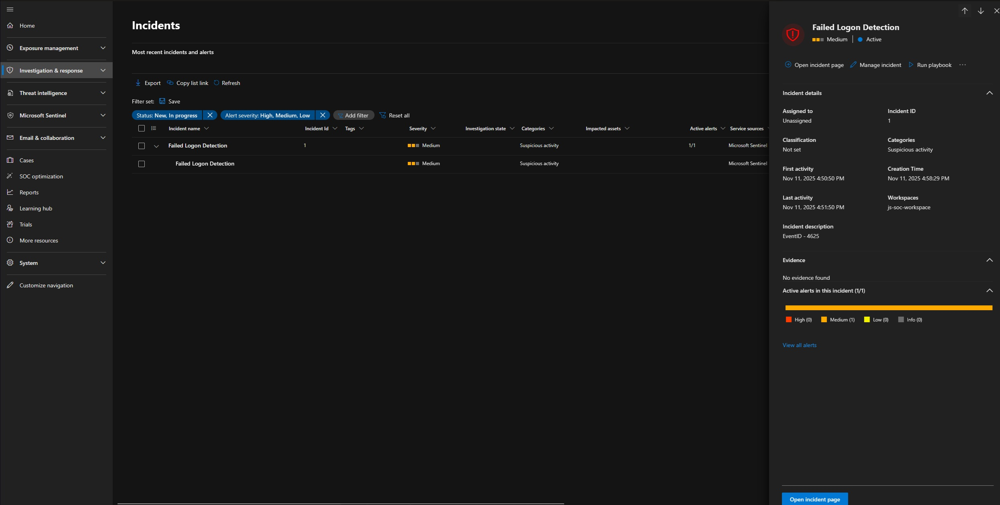
* **Szczegóły konkretnego incydentu:**
    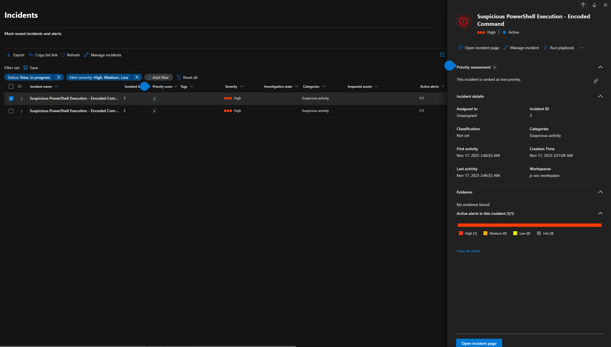
    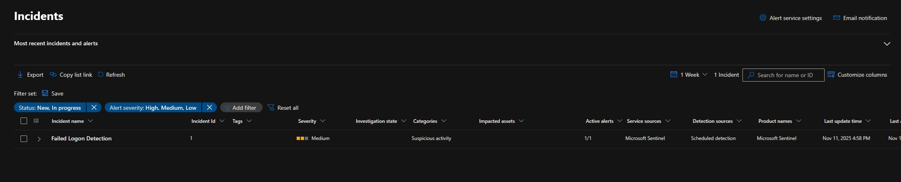
* **Obsługa błędów:**
    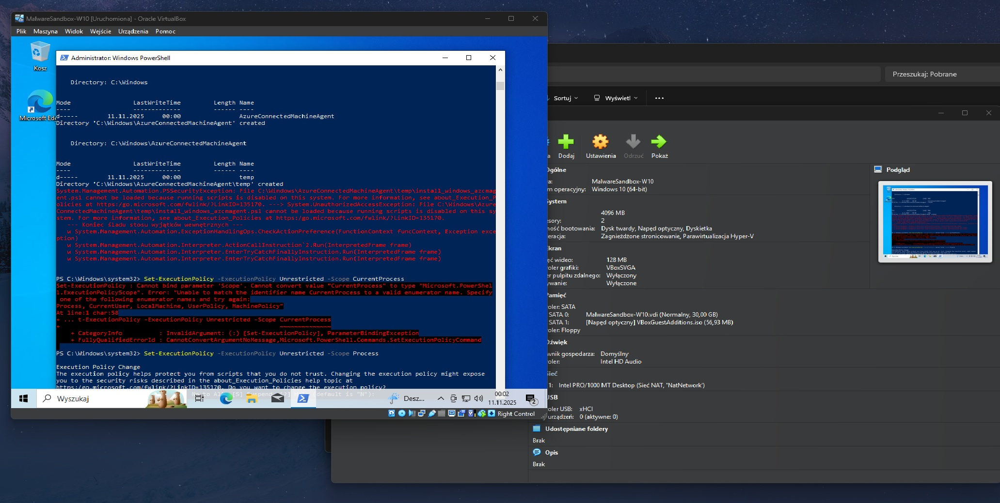

---

## 5. Automatyzacja (SOAR)
Konfiguracja Playbooków w Azure Logic Apps do automatycznej reakcji na incydenty (np. izolacja maszyny, wysłanie powiadomienia, założenie biletu w Jira).

* **Logika Playbooka (Logic App):**
    
* **Integracja z Jira (Ticket System):**
    
    *Automatyczne tworzenie zadania dla analityka po wykryciu incydentu o wysokim priorytecie.*

---

## 6. Wizualizacja Danych (Workbooks)
Dashboardy służące do monitorowania stanu bezpieczeństwa w czasie rzeczywistym.

* **Wykresy i trendy:**
    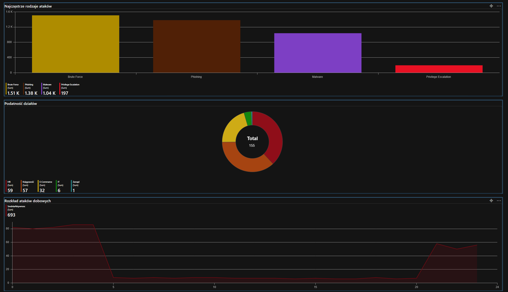
* **Tabela zdarzeń:**
    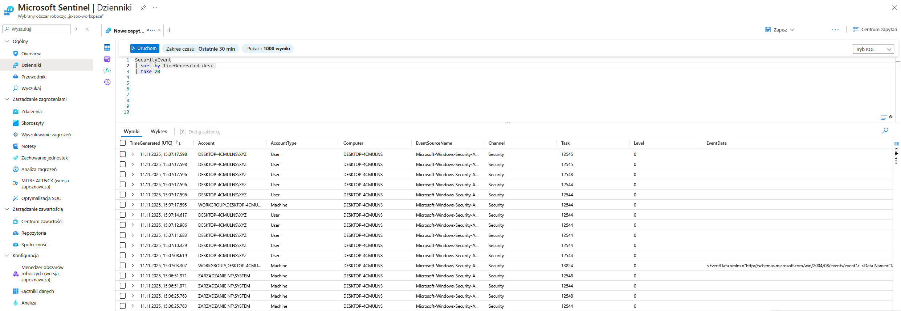
* **Panel główny:**
    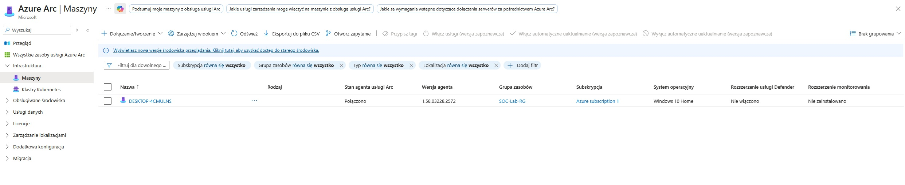
* **Mostek sieciowy (Bridge):**
    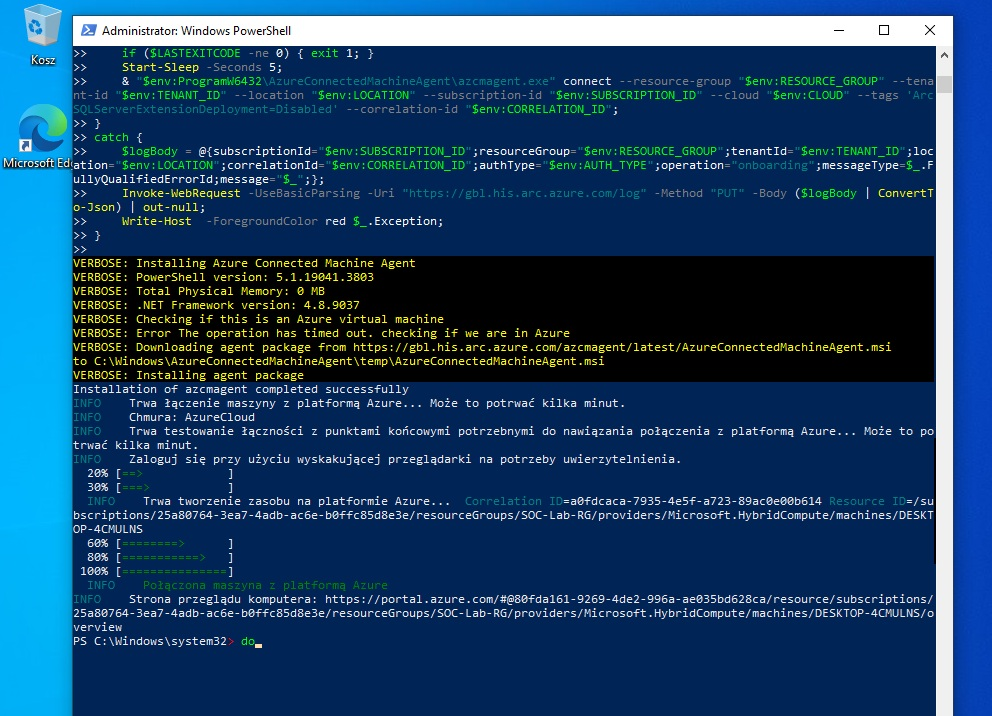
